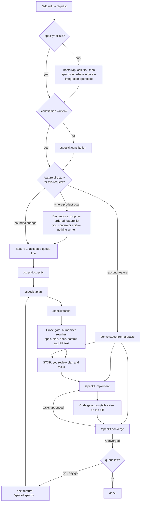

# opencode-sdd-orchestrator

[](https://github.com/pjotrvv/opencode-sdd-orchestrator/actions/workflows/check.yml)

Spec-driven development orchestration for [OpenCode](https://opencode.ai). One
skill holds the pipeline state machine, one command starts it. The work itself
stays with the tools it wires together:

| Piece | Role |
| --- | --- |
| [github/spec-kit](https://github.com/github/spec-kit) | The SDD pipeline: `/speckit.constitution` → `specify` → `plan` → `tasks` → `implement` → `converge` |
| [blader/humanizer](https://github.com/blader/humanizer) | Prose gate: rewrites spec, plan, and doc text so a person can read it |
| [DietrichGebert/ponytail](https://github.com/DietrichGebert/ponytail) | Code gate: lazy senior-dev review of the diff before converge |

## Workflow

One state machine, three ways in. The state is what exists under `.specify/` —
no state file to go stale:

- **Goal run** — `/sdd Build a Markdown-to-Discord library`: decompose
  proposes an ordered feature list, you confirm or edit it, then feature 1
  runs specify → plan → tasks and stops so you can read the plan before any
  code exists.
- **Bounded run** — `/sdd Add CSV export to the orders page`: one PR-sized
  change, skips decomposition, same pipeline.
- **Advance** — `/sdd`: derives the current stage from the artifacts, runs
  it, names the next one. `/sdd plan` or any other stage name forces that
  stage instead.



The implement → converge loop repeats until converge reports `Converged`;
after 3 cycles without it the run stops and reports what is still open.

## Commands

### This pack

| Command | What runs |
| --- | --- |
| `/sdd Build a Markdown-to-Discord library` | Goal run: decompose → you confirm → feature 1 specify → plan → tasks → stop |
| `/sdd Add CSV export to the orders page` | Bounded run: no decomposition; specify → plan → tasks → stop |
| `/sdd` | Advance: derive the stage from `.specify/`, run it, name the next |
| `/sdd plan` | Explicit stage: forces `/speckit.plan` (prerequisites first if missing) |
| `/sdd <feature-slug>` | Targets a specific directory under `.specify/specs/` |

### spec-kit commands (installed on first bootstrap)

Invoked dotted in OpenCode, e.g. `/speckit.specify`:

| Command | Purpose | When |
| --- | --- | --- |
| `/speckit.constitution` | Project principles every stage is judged against | Once per project |
| `/speckit.specify` | Requirements — the what and why | Per feature |
| `/speckit.clarify` | Encodes answers to ambiguity questions into `spec.md` | Optional, after specify |
| `/speckit.plan` | Technical design — the how | Per feature |
| `/speckit.checklist` | Requirements QA ("unit tests for the spec") | Optional, after plan |
| `/speckit.tasks` | Dependency-ordered tasks, one phase per user story | Per feature |
| `/speckit.analyze` | Read-only cross-artifact consistency report | Optional, after tasks |
| `/speckit.implement` | Codes the tasks in dependency order | Per feature |
| `/speckit.converge` | Verdict: `Converged`, or appends missed tasks | Loop with implement |

Bootstrap installs these into `.opencode/commands/speckit.*.md`. Full
reference: [spec-kit's agentic SDD docs](https://github.github.io/spec-kit/reference/agentic-sdd.html).

## Install

Run these in the project where you want SDD.

**1. spec-kit** (the pipeline):

```sh
uv tool install specify-cli    # or: pipx install specify-cli
```

**2. Gates:**

```sh
npx skills add blader/humanizer --agent opencode        # prose gate
```

Add `--global` to install it for every project. The code gate is installed
once, globally, per the [ponytail README](https://github.com/DietrichGebert/ponytail).

**3. This pack:**

```sh
git clone https://github.com/pjotrvv/opencode-sdd-orchestrator /tmp/sdd-orch
cp -r /tmp/sdd-orch/.opencode .
rm -rf /tmp/sdd-orch
```

For every project instead of one, copy the two files into the global dirs:

```sh
cp -r /tmp/sdd-orch/.opencode/commands/sdd.md ~/.config/opencode/commands/
cp -r /tmp/sdd-orch/.opencode/skills/sdd-orchestrator ~/.config/opencode/skills/
```

**4. First run:** `/sdd <what you want to build>`. On a project without
`.specify/` the skill asks, then runs
`specify init --here --force --integration opencode` to install the
`/speckit.*` commands.

## Requirements

- OpenCode v2. No plugin, no runtime, no build step.
- Missing gates do not stop the pipeline; `/sdd` says what it skipped.
- CI runs `scripts/check.py` on every push: pack structure, plus every
  `/speckit.*` name the skill references against spec-kit's live templates.

## License

MIT. The three upstream projects are MIT licensed by their own authors.
